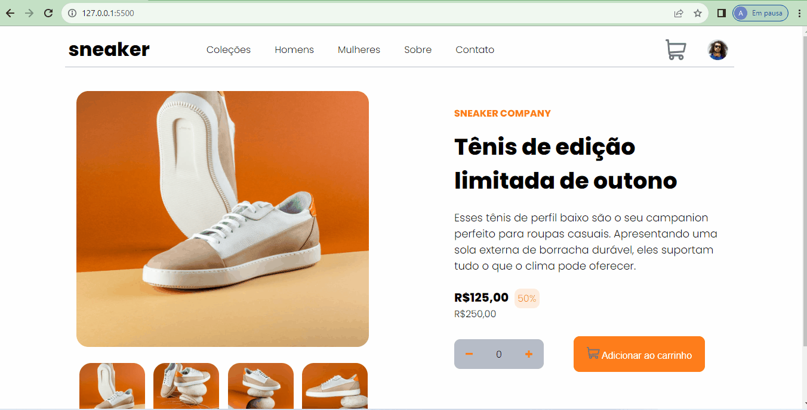

# Ecommerce
Single page de um ecommerce. Trata-se de uma page onde o usuário está logado na conta de uma loja virtual para comprar um tênis, podendo escolher a quantidade que desejar e ao final ele verá a quantidade escolhida e o valor a ser pago. 

## Tecnologias utilizadas
- HTML
- CSS
- JAVASCRIPT
- JQUERY

## Projeto em execução

